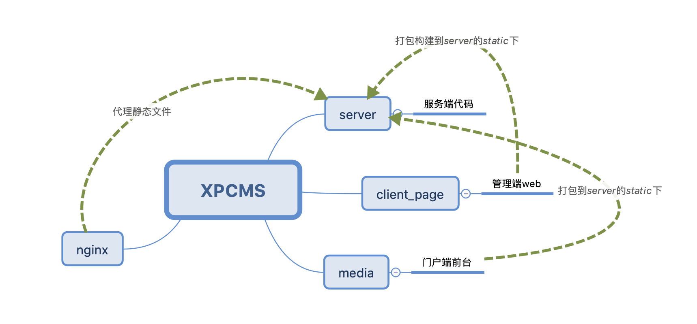

<h1 align="center" style="font-size:36px;font-weight:bold">
  XPCMS
</h1>

# XPCMS

XPCMS是一个开源的CMS系统，服务端采用node+koa+redis+json-schema实现.view层管理端使用vue生态，客户端使用react生态。架构如下：




# 安装

server,client_page,media这三端都可以采用如下安装方式安装依赖：
```js
npm install
// or yarn
```

# 开发环境启动

#### 1.安装redis并启动redis服务
具体细节请参考我的文章[基于nodeJS从0到1实现一个CMS全栈项目的服务端启动细节](https://juejin.im/post/5d8f5107f265da5bb74640eb)
#### 2.启动server后台服务
``` js
npm start
```
#### 3.启动管理后台页面
``` js
npm run serve
// or yarn serve
```
#### 4.启动前台门户页面
``` js
npm start
```

# 生产环境部署方案
#### 1.打包服务端代码
``` js
// server
npm run build
```

#### 2.打包管理端web代码
``` js
// client_page
npm run build
```

#### 3.打包门户网站代码
``` js
// media
npm run build
```

#### 4.服务器部署
> 我们可以使用代码管理工具如gitlab或者公司私有仓库管理代码，然后提交到服务器上，如果对git/svn部署不太了解，我们可以将server目录整体发送到web服务器中，安装相关依赖并运行，但这种方式不推荐。

##### 1.pm2做服务端持久化
假设我们服务器上安装好了redis并启动了服务，我们可以使用pm2去做node服务崩溃自动重启：
``` bash
npm install -g pm2
# 启动node程序
pm2 dist
```
更多细节我会持续完善。

# nginx做静态代理服务器
这里需要先在web服务器中安装nginx，安装过程也很简单，可以去官网查看。
这里给出如何用nginx代理多网站的方案：
``` bash
#user  nobody;
worker_processes  1;

#error_log  logs/error.log;
#error_log  logs/error.log  notice;
#error_log  logs/error.log  info;

#pid        logs/nginx.pid;


events {
    worker_connections  1024;
}


http {
    include       mime.types;
    default_type  application/octet-stream;

    log_format  main  '$remote_addr - $remote_user [$time_local] "$request" '
                      '$status $body_bytes_sent "$http_referer" '
                      '"$http_user_agent" "$http_x_forwarded_for"';

    access_log  logs/access.log  main;

    sendfile        on;
    #tcp_nopush     on;

    #keepalive_timeout  0;
    keepalive_timeout  65;

    #gzip  on;

    server {
        listen       80;
        server_name  localhost;

        #charset koi8-r;

        #access_log  logs/host.access.log  main;

        location / {
            root   /www/XPXMS/server/static/cmsClient; 
            index  index.html index.htm;
            # 在生产环境vue使用history router的配置
	          try_files $uri $uri/ /index.html;
        }

        error_page  404        /www/XPXMS/server/static/adminManage/index.html;

        # redirect server error pages to the static page /50x.html
        #
        error_page   500 502 503 504  /50x.html;
        location /50x.html {
            root   html;
        }

        # proxy the PHP scripts to Apache listening on 127.0.0.1:80
        # api的请求代理到node服务器
        location /api {
            proxy_pass http://127.0.0.1:3000;
        }

        # pass the PHP scripts to FastCGI server listening on 127.0.0.1:9000
        #
        location ~ \.php$ {
            root           html;
            fastcgi_pass   127.0.0.1:9000;
            fastcgi_index  index.php;
            fastcgi_param  SCRIPT_FILENAME  $document_root/$fastcgi_script_name;
            include        fastcgi_params;
        }

        # deny access to .htaccess files, if Apache's document root
        # concurs with nginx's one
        #
        #location ~ /\.ht {
        #    deny  all;
        #}
    }


    # another virtual host using mix of IP-, name-, and port-based configuration
    #
    server {
        listen       8000;
       # listen       somename:8080;
        server_name  localhost;

        location / {
            root  /www/XPXMS/server/static/adminManage;
            index  index.html index.htm;
            # 在生产环境react使用history router的配置
	          try_files $uri $uri/ /index.html;
        }

        location /api {
            proxy_pass http://127.0.0.1:3000;
        }

        location /uploads {
            root /www/XPXMS/server/public/;
        }
    }


    # HTTPS server
    #
    #server {
    #    listen       443 ssl;
    #    server_name  localhost;

    #    ssl_certificate      cert.pem;
    #    ssl_certificate_key  cert.key;

    #    ssl_session_cache    shared:SSL:1m;
    #    ssl_session_timeout  5m;

    #    ssl_ciphers  HIGH:!aNULL:!MD5;
    #    ssl_prefer_server_ciphers  on;

    #    location / {
    #        root   html;
    #        index  index.html index.htm;
    #    }
    #}

}

```

# License

MIT [http://rem.mit-license.org](http://rem.mit-license.org)
